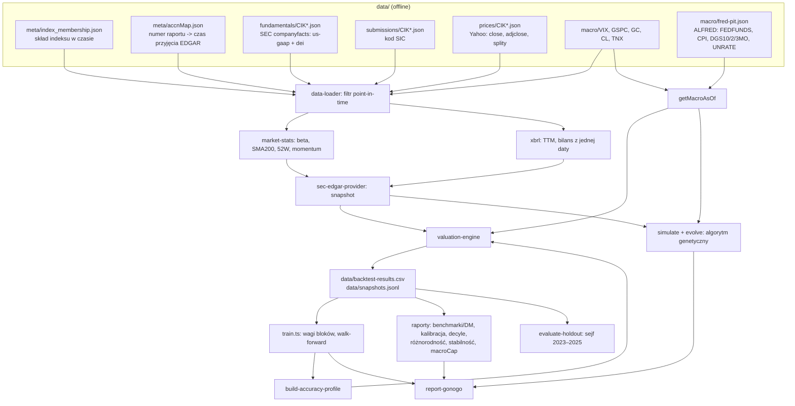

# Jak działa Valuation System 2.0 — raport kompleksowy

Stan na 2026-09-15, po naprawach opisanych w [`RAPORT-ZMIAN.md`](RAPORT-ZMIAN.md). Dokument opisuje, co system robi krok po kroku, jakimi wzorami i na jakich danych. Każda liczba wynikowa pochodzi z pliku w `artifacts/`, a plik jest wskazany przy liczbie.

---

## 1. Cel i dwa tryby pracy

System dla spółki i daty liczy **wartość godziwą** (*Fair Value*), **cenę wejścia** (*Entry Target*), **werdykt** (BUY/HOLD/SELL) i **wskaźnik pewności** (`confidenceScore`).

| Tryb | Wejście | Kod | Po co |
|---|---|---|---|
| **Wycena bieżąca (API)** | Yahoo Finance (quoteSummary, fundamentalsTimeSeries), FRED (dziś), wskaźniki techniczne | `src/server.ts`, `src/routes/valuation.ts`, `src/yahoo-mapper.ts`, `nextjs-drop-in/` | wycena „na teraz” dla pojedynczego tickera |
| **Backtest point-in-time** | cache SEC XBRL + ceny Yahoo + skład S&P 500 w czasie + ALFRED | `scripts/generate-dataset.ts` i dalsze skrypty | sprawdzenie, czy wycena przewidywała przyszłe zwroty, uczenie wag, ocena Go/No-Go |

Oba tryby używają tego samego silnika (`src/valuation-engine.ts`). Różni je tylko sposób zbudowania wejścia, czyli *snapshotu*.

## 2. Przepływ danych



## 3. Dane wejściowe

| Źródło | Plik | Co zawiera | Uwagi |
|---|---|---|---|
| Skład indeksu | `data/meta/index_membership.json` | 841 wpisów: CIK, ticker, data dodania, usunięcia, powód | 20 wpisów z datą dodania późniejszą niż usunięcia (ignorowane) |
| Fakty XBRL | `data/fundamentals/CIK*.json` | SEC companyfacts: każdy fakt ma okres (`start`/`end`), wartość i numer raportu (`accn`) | ładowane ~60 konceptów us-gaap + liczba akcji z `dei` |
| Czas publikacji | `data/meta/accnMap.json` | ~2 mln raportów → czas przyjęcia przez EDGAR | bez tej mapy system odmawia startu |
| Kod SIC | `data/submissions/CIK*.json` | branża SEC | stan bieżący, nie historyczny |
| Ceny | `data/prices/CIK*.json` | dzienne `close` (skorygowane o splity), `adjclose` (także o dywidendy), splity | ~500 spółek |
| Rynek | `data/macro/*.json` | VIX, ^GSPC, złoto, ropa, 10Y z Yahoo | nierewidowane — z natury point-in-time |
| Makro rewidowane | `data/macro/fred-pit.json` | dla każdej z 80 dat decyzji: obserwacje FRED widoczne tego dnia (ALFRED) | spread HY dostępny tylko ~3 ostatnie lata |

## 4. Zasada point-in-time (brak zaglądania w przyszłość)

To najważniejsza własność backtestu. Dla daty decyzji `asOf` system używa wyłącznie informacji, które były wtedy publiczne.

1. **Fundamenty.** Fakt XBRL jest widoczny, gdy raport, w którym się pojawił, został przyjęty przez EDGAR przed notowaniem z dnia decyzji (`getFundamentalsAsOf`). Każdy fakt ma własny numer raportu. Liczba za 2019 powtórzona w raporcie z 2021 jest więc widoczna dopiero od 2021.
2. **Ceny.** Notowanie z dnia decyzji albo ostatniej sesji przed nim. Notowanie starsze niż 10 dni to „brak ceny”, a nie cicha cena sprzed lat.
3. **Statystyki rynkowe.** Beta, SMA200, 52W i momentum liczone tylko z notowań do `asOf` włącznie.
4. **Makro.** Stopa Fed, CPI i bezrobocie są rewidowane, więc bierzemy je z ALFRED z `realtime_start = realtime_end = asOf`, czyli tak, jak widział je rynek tego dnia. Rentowności i VIX nie są rewidowane.
5. **Skład indeksu.** Wycena obejmuje tylko spółki, które w dniu decyzji były w indeksie.
6. **Świeżość.** Bilans starszy niż 400 dni → spółka pomijana. Starsze niż 90 dni obniża `confidenceScore`.
7. **Etykieta.** Zwrot za 12 miesięcy (i 3 miesiące) z `adjclose` jest wyłącznie etykietą. Nigdy nie wchodzi do cech.

Znane wyjątki: kod SIC jest bieżący, a skład indeksu w cache jest obciążony przeżyciem (rozdział 13).

## 5. Od faktów XBRL do snapshotu (`src/xbrl.ts`, `src/sec-edgar-provider.ts`)

Snapshot ma kształt odpowiedzi Yahoo (`YahooFinanceSnapshot`), dzięki czemu silnik działa tak samo dla obu źródeł. Pole, którego nie da się policzyć, ma wartość `null`. Nie ma wartości zastępczych.

### 5.1 Okresy i TTM

W companyfacts `fy`/`fp` opisują **raport**, a nie okres faktu. Okres jest więc wyznaczany z dat `start`/`end`, a przy duplikatach wygrywa najnowszy raport znany w `asOf`. Wartość za 12 miesięcy (`ttm`) to pierwsza z możliwości, która się udaje:

1. okres roczny (340–390 dni) kończący się na najnowszej dacie;
2. **FY poprzedni + YTD bieżący − YTD sprzed roku**, np. TTM do czerwca = FY + H1 bieżący − H1 poprzedni;
3. suma czterech kolejnych kwartałów (75–105 dni);
4. inaczej `null`.

Gdy spółka zmienia tag (np. `SalesRevenueNet` → `RevenueFromContractWithCustomer…` w 2018), wygrywa koncept z najświeższym okresem. Wartości sprzed roku (do wzrostów, F- i M-Score) liczone są tym samym konceptem co bieżące.

### 5.2 Liczba akcji i splity

Kolejność źródeł: `dei:EntityCommonStockSharesOutstanding` (strona tytułowa raportu) → `us-gaap:CommonStockSharesOutstanding` → średnia rozwodniona. Wybierana jest najświeższa wartość. Ceny Yahoo są skorygowane o wszystkie splity do dziś, więc liczba akcji jest mnożona przez splity **po dacie jej raportu**. Wszystkie wartości na akcję są wtedy w tej samej bazie co cena. Brak liczby akcji → spółka pomijana z powodem (dawniej przyjmowano 1 000 000).

### 5.3 Bilans i dług

Wszystkie pozycje bilansu pochodzą z tej samej daty bilansowej (±5 dni) co `Assets`. Dług to `LongTermDebtNoncurrent` (albo `LongTermDebt − LongTermDebtCurrent`) plus `DebtCurrent` (albo suma części bieżącej LTD, krótkoterminowych pożyczek i commercial paper). Część bieżąca długu nie jest liczona dwa razy.

### 5.4 Pola pochodne

| Pole | Wzór |
|---|---|
| EPS | zysk netto TTM / akcje |
| BVPS | kapitał własny / akcje |
| FCF | przepływy operacyjne TTM − \|capex TTM\| (brak capex → `null`) |
| EBITDA | EBIT TTM + amortyzacja TTM |
| revenueGrowth, earningsGrowth | TTM / TTM sprzed roku − 1 (wzrost zysku tylko przy dodatnim zysku bazowym) |
| dividendRate, dividendYield, payoutRatio | wypłacone dywidendy TTM / akcje; / cena; / zysk netto |
| debtToEquity (w %), ROE, marża | dług / kapitał × 100; zysk / kapitał; zysk / przychody |
| stopa podatkowa | podatek / zysk przed opodatkowaniem, przycięta do [0, 50%] |
| investedCapital | kapitał + dług − gotówka |
| sektor | dywizja SIC (6000–6799 → `Financial Services`) |
| Piotroski F-Score | 9 sygnałów (ROA > 0, CFO > 0, ΔROA > 0, CFO > zysk, Δdźwignia < 0, Δwskaźnik bieżący > 0, brak emisji, Δmarża brutto > 0, Δrotacja aktywów > 0) — tylko przy komplecie danych |
| Beneish M-Score | −4.84 + 0.920·DSRI + 0.528·GMI + 0.404·AQI + 0.892·SGI + 0.115·DEPI − 0.172·SGAI + 4.679·TATA − 0.327·LVGI — tylko przy komplecie 8 zmiennych |
| statystyki rynkowe (`src/market-stats.ts`) | beta = cov/var dziennych log-zwrotów vs ^GSPC z 2 lat (min. 250 par), SMA200, max/min 52W, momentum 12-1, obsunięcie od szczytu 24M |

### 5.5 Cechy ryzyka bankructwa (`src/default-features.ts`)

Altman Z (przycięty do ±10), dług netto / EBITDA (EBITDA ≤ 0 → 10), pokrycie odsetek EBIT / odsetki (brak odsetek → 50), liczba kolejnych kwartałów z ujemnym FCF TTM, obsunięcie 24M. Ta sama funkcja jest używana w treningu i w produkcji.

## 6. Silnik wyceny (`src/valuation-engine.ts`)

### 6.1 Archetypy (`src/archetypes.ts`)

Każdy z 6 archetypów ma listę kryteriów z wagami. Wynik archetypu = suma wag spełnionych kryteriów / suma wszystkich wag. Wyniki są normalizowane do sumy 1, więc spółka może być np. w 55% VALUE_COMPOUNDER i w 45% INCOME_STABLE. Archetyp z najwyższym wynikiem to `dominantArchetype`.

| Archetyp | Główne kryteria (wszystkie progi arbitralne) |
|---|---|
| HYPER_GROWTH | wzrost przychodów > 15%, marża < 8%, brak dywidendy, β > 1.2, C/Z brak lub > 40 |
| VALUE_COMPOUNDER | dywidenda > 1.5%, payout 15–75%, wzrost zysku −5…15%, C/Z 8–28, ROE > 12% |
| FINANCIALS_BANKS | sektor „Financial Services” (waga 3), dług/kapitał > 300%, ROE 8–20%, dywidenda > 1% |
| CYCLICAL_HEAVY | dług/kapitał > 100%, \|zmiana zysku\| > 25%, β > 1.1, dywidenda 1–4%, marża < 10% |
| INCOME_STABLE | dywidenda > 3.5%, payout > 70%, β < 0.9, wzrost przychodów < 8% |
| DEEP_VALUE_DISTRESSED | EPS ≤ 0, FCF ≤ 0, C/WK < 1, dług/kapitał > 150%, ROE < 0 |

### 6.2 Dziesięć modeli wyceny

Oznaczenia: *r* — wymagana stopa zwrotu, *g* — wzrost, CPI — inflacja r/r z makro (0, gdy makro nieznane).

**Wymagana stopa zwrotu (CAPM):** `r = clamp(rf + β·ERP + 0.5·CPI, 6%, 20%)`, gdzie:
- `rf = clamp(rentowność 10Y, 1%, 8%)` (bez makro 4%);
- `ERP = clamp(5% + 1.5pp przy odwróconej krzywej + 1pp w bessie + 0.5pp przy rosnącym CPI, 4%, 9%)`;
- β = 1, gdy nieznana (z ostrzeżeniem).

| Model | Wzór (na akcję) | Kiedy `null` |
|---|---|---|
| DCF | 5 lat FCF, wzrost liniowo od `clamp(revenueGrowth, −10%, cap) + 0.5·CPI` do terminalnego `clamp(2.5% + 0.5·CPI, 2%, 5%)`, dyskonto *r*, wartość rezydualna Gordona. `cap = 25% − 3pp (Fed > 5%) − 2pp (CPI > 4%) − 2pp (podwyżki)`, w [10%, 25%] | FCF ≤ 0, brak akcji |
| Liczba Grahama | √(22.5 · EPS · BVPS skorygowane) | EPS ≤ 0, BVPS ≤ 0 |
| DDM (Gordon) | D·(1+g)/(r−g), `g = clamp(wzrost zysku + 0.5·CPI, 0, 8%)`, g ≤ r − 1pp | brak dywidendy |
| PEG = 1 | EPS × clamp(wzrost zysku w %, 5, 40) | EPS ≤ 0 lub brak wzrostu |
| EV/EBITDA | (EBITDA × mnożnik − dług + gotówka) / akcje | EBITDA ≤ 0 |
| P/B | BVPS skorygowane × mnożnik | BVPS ≤ 0 |
| Rentowność FCF | FCF na akcję / clamp(5% + 2%·(β−1), 4%, 12%) | FCF ≤ 0 |
| EPV (Greenwald) | zysk na akcję / r × premia, premia = clamp(1 + ROIC − r, 1, 1.5), gdy ROIC > r | zysk ≤ 0 |
| P/S | przychód na akcję × mnożnik | przychód ≤ 0 |
| Wartość likwidacyjna | max(0, (gotówka·1 + należności·0.7 + zapasy·0.5 + środki trwałe·0.3 − zobowiązania) / akcje) | brak zobowiązań |

Mnożniki P/B, P/S i EV/EBITDA to stałe per archetyp (`ANCHOR_MULTIPLES`, np. P/B: banki 1.5, hyper-growth 12), mieszane wagami archetypów. To nie są mediany grup porównawczych. **BVPS skorygowane** = BVPS − (koszt zamortyzowany HTM − wartość godziwa HTM) / akcje; AOCI już jest w kapitale i nie jest dodawane. Dodatkowo, wyłącznie informacyjnie (w ostrzeżeniach, bez wpływu na wycenę), liczone są: Altman Z, spread ROIC−WACC, implikowany wzrost z odwrotnego DCF oraz konsensus analityków (tylko Yahoo).

### 6.3 Bloki i wagi

Modele są grupowane w 4 bloki. Wartość bloku to **mediana** modeli, które zwróciły liczbę:

| Blok | Modele |
|---|---|
| BLOK_CASHFLOW | DCF, rentowność FCF, EPV |
| BLOK_ASSETS | Graham, P/B, likwidacyjna |
| BLOK_MULTIPLES | EV/EBITDA, P/S, PEG |
| BLOK_DIVIDEND | DDM |

Waga bloku to `w_b = Σ_archetypy (pewność archetypu × W[archetyp][b] × m)`, gdzie *m* jest mnożnikiem makro przyciętym do `[1 − macroCap, 1 + macroCap]` (domyślnie ±25%). Fair Value to średnia bloków obecnych w wierszu, ważona `w_b` i renormalizowana po tych blokach. `W` to macierz ekspercka `WEIGHT_MATRIX` albo wagi z artefaktu (`artifacts/block-weights.json`).

**Niska pewność** (`lowConfidence`) oznacza jedną z sytuacji: brak bloków, suma wag ≈ 0, mniej niż 2 bloki albo mniej niż 4 modele.

### 6.4 Korekty wyceny

Kolejność:
1. **Jakość zysków.** Konsekwentne pozytywne lub negatywne niespodzianki (tylko Yahoo) dają ×1.05 / ×0.95. M-Score > −1.78 daje ×0.5. F-Score ≤ 3 daje ×0.7, a ≥ 7 daje ×1.1.
2. **Bezpiecznik.** Fair Value przycinana do [0.2×, 5×] ceny.
3. **Ryzyko bankructwa.** Przy znanym `pDefault`: `FV = (1 − p)·FV + p·wartość likwidacyjna`. Przy nieznanym (`null`) wycena bez zmian.

### 6.5 Margines bezpieczeństwa, cena wejścia, werdykt

`MoS = clamp(bazowy + β + trend + zakres + VIX + techniczne, 5%, 80%)`:
- **bazowy** — średnia ważona archetypami: HG 35%, VC 15%, FIN 20%, CYC 30%, INC 10%, DV 50%;
- **β**: `clamp(0.1·(β − 1), −5pp, +20pp)`;
- **trend**: `clamp(0.1·(cena − SMA200)/SMA200, −5pp, +10pp)`;
- **zakres 52W**: +5pp w górnych 20%, −5pp w dolnych 20%;
- **VIX**: `0.5pp · max(0, VIX − 20)`;
- **techniczne** (tylko API na żywo): RSI, MACD, Bollinger, SMA — ±10pp.

**Entry Target** = FV × (1 − MoS). **Werdykt:**
- BUY — cena < Entry Target i wycena nie jest `lowConfidence`;
- SELL — cena > 1.1 × FV;
- w pozostałych przypadkach HOLD.

### 6.6 confidenceScore

```
confidence = clamp( 0.4 · min(liczba modeli / 8, 1)
                  + 0.6 · dokładność archetypu
                  − kara bankructwa
                  − kara świeżości
                  − kara VIX, 0, 1)
```

- **dokładność** = `clamp(1 − 2 · mediana błędu OOS archetypu, 0, 1)` z `artifacts/accuracy-profile.json`. Brak profilu albo archetyp z n < 200 → 0.5 i ostrzeżenie.
- **kara bankructwa** = `pDefault`, a gdy `pDefault` jest nieznane — stała 0.15.
- **kara świeżości** = `clamp((dni od bilansu − 90)/180, 0, 0.5)`.
- **kara VIX** = `0.005 · max(0, VIX − 20)`.

### 6.7 Wycena zespołowa

`calculateEnsembleFairValue` uśrednia FV, Entry Target, MoS i confidence po ekspertach, których wynik nie jest `lowConfidence`. Od confidence odejmuje `clamp(2 × rozrzut FV, 0, 0.8)`.

## 7. Dataset backtestu (`scripts/generate-dataset.ts`)

Jeden wiersz to para (spółka, data decyzji), dla 80 dat 2006-05-15 … 2026-02-15. Wiersz powstaje, gdy spółka była w indeksie, ma cenę i fundamenty, mapper nie odrzucił snapshotu i istnieje etykieta 12M. Każdy powód odrzucenia jest liczony w `artifacts/generate_stats.json`. Wiersze `lowConfidence` **nie** są usuwane, tylko oznaczane flagą.

Kolumny:
- identyfikacja: `cik`, `ticker`, `asOf`, `sector`, `sic`, `price`;
- etykiety: `fwdReturn12m`, `fwdReturn3m`, `target_excess` (zwrot minus mediana sektora w tym kwartale);
- 10 modeli;
- wynik silnika: `fairValue`, `upside`, `entryTarget`, `marginOfSafety`, `confidenceScore`, `validModelCount`, `lowConfidence`, `pDefault`, `verdict`, `capHits`, `dominantArchetype`;
- cechy benchmarków: `beta`, `bookValuePerShare`, `eps`, `fcfPerShare`, `momentum12_1`, `marketCap`, `stalenessDays`.

Kolumny wyniku są liczone **eksperckim** `WEIGHT_MATRIX`, żeby dataset nie zawierał wyników dopasowanych do samego siebie. Równolegle powstaje `data/snapshots.jsonl` (snapshot + makro dla każdego wiersza), który pozwala przeliczać wyceny bez ponownego ładowania cache.

## 8. Podział danych i ochrona przed wyciekiem

Szczegóły: [`data-splits.md`](data-splits.md).

- **Trening i walidacja: 2006–2021.** Walk-forward na 8 blokach dwuletnich. Z treningu usuwane są obserwacje, których okno etykiety `[asOf, asOf+12M]` przecina blok testowy, oraz obserwacje z 3-miesięcznego embargo po bloku (`src/purging.ts`).
- **Embargo: 2022.** Nie służy do uczenia. Jest wspólnym zbiorem do porównania ekspertów.
- **Sejf holdout: 2023–2025.** Dostęp tylko przez `scripts/evaluate-holdout.ts`, maksymalnie 3 dotknięcia, a próg p-value maleje z każdym (Bonferroni). Dotknięcie jest rejestrowane **po** udanych obliczeniach. Warunki wstępne sprawdzane są bez zużycia dotknięcia: wagi z artefaktu, czyste repozytorium git z prawdziwym hashem, ≥ 500 wierszy, rozłączne daty z treningiem. Wpis RESET w logu unieważnił trzy wcześniejsze „dotknięcia” wykonane na pustym zbiorze.

## 9. Uczenie

### 9.1 Wagi bloków (`scripts/train.ts`, `src/block-model.ts`)

- **Model:** prognoza ceny za 12M / cena dziś = średnia (blok/cena) ważona wagami archetypu i renormalizowana po obecnych blokach. Blok/cena jest przycinany do [0, 5], a prognoza do [0.2, 5].
- **Strata:** `mean|prognoza − (1 + zwrot 12M)| + λ·‖w − prior‖²`, przy `w ≥ 0`, `Σw = 1`.
- **Optymalizator:** deterministyczny projektowany subgradient z rzutowaniem na sympleks. Alternatywnie przeszukiwanie losowe ze stałym ziarnem (to nie jest CMA-ES).
- **Dobór λ ∈ {0, 0.01, 0.1, 1, 10, 100}:** po średnim błędzie walidacyjnym z foldów walk-forward. Potem trening na całym 2006–2021.
- **Archetyp z n < 200:** wagi priora (`fallbackToPrior`).
- **Artefakty:** `artifacts/block-weights.json` (wagi, λ, metryki CV, IC IS/OOS, liczebności) i `artifacts/oos-predictions.csv`.

### 9.2 Profil dokładności (`scripts/build-accuracy-profile.ts`)

Dla każdego archetypu: mediana `|prognoza − zwrot| / (1 + zwrot)` na predykcjach **out-of-sample** z foldów, n, liczba foldów i CI95 z bootstrapu po kwartałach. Archetyp z n < 200 → `null`. Wynik zasila składnik „dokładność” w `confidenceScore`.

### 9.3 Model prawdopodobieństwa bankructwa (`scripts/train-default-model.ts`)

**Etykieta** ([`default-label-definition.md`](default-label-definition.md)): usunięcie z indeksu w ciągu 12M z powodu bankructwa, albo usunięcie z innego powodu niż przejęcie lub fuzja połączone z ujemnym kapitałem lub spadkiem ceny > 85% od szczytu 36M. Zdarzenia z lat 2022–2025 nie trafiają do treningu.

**Model:**
- regresja logistyczna z L2 na 5 standaryzowanych cechach (5.5);
- negatywy losowane ze stałym ziarnem w proporcji 1:20, a wyraz wolny korygowany o ln(odsetek zachowanych negatywów);
- λ dobierana na walidacji 2014–2017, ocena OOS na 2018–2021;
- raport: AUC, ROC/PR, kalibracja, znaki wag.

Poniżej 20 zdarzeń w treningu model **nie jest zapisywany**. Wtedy `pDefault = null` w całym systemie.

### 9.4 Algorytm genetyczny (`scripts/evolve.ts`, `scripts/ga.ts`, `scripts/simulate.ts`)

**Genom** to trzy macierze wag bloków (osobno na podwyżki, utrzymanie i obniżki stóp — reżim wg FEDFUNDS z ALFRED) oraz 13 parametrów portfela:
- liczba pozycji i wielkość pozycji;
- próg sprzedaży przewartościowanej, stop-loss, minimalny upside, minimalna liczba modeli;
- trzy progi VIX i cztery udziały akcji w portfelu.

**Symulator** najpierw buduje „uniwersum”: snapshoty i makro dla każdego kwartału, liczone raz. Następnie dla każdego genomu, kwartał po kwartale:
- odsetki od gotówki po stopie 3M;
- obsługa spółek, które przestały być notowane: przejęcie → ostatnia cena, inne → 0;
- wycena kandydatów i reguły sprzedaży: przewartościowanie, stop-loss, słabe fundamenty; dla pozostałych pozycji dywidendy;
- zakupy od największego upside (tylko cena < Entry Target i upside > minimum);
- wymuszona sprzedaż, gdy udział akcji przekracza limit VIX;
- koszt 10 bps od każdej transakcji.

Okresy zamaskowane dzielą symulację na segmenty, a na końcu segmentu portfel jest likwidowany.

**Fitness** = 0.5 · min(max(Sortino, 0), 3)/3 + 0.3 · (clamp(alfa roczna vs ^GSPC, ±0.5) + 0.5) + 0.2 · (1 − maxDD). Mniej niż 20 transakcji → −∞.

**Ewolucja:** elita 10%, selekcja turniejowa (4) z całej populacji, krzyżowanie i mutacja z malejącym tempem, 10% losowych imigrantów.

**Ekspert *i*:**
- blok testowy — nigdy nie używany do uczenia ani wyboru;
- blok walidacyjny — sąsiedni; na nim co 10 pokoleń wybierany jest najlepszy genom;
- trening — pozostałe lata.

Na końcu jedna ocena na bloku testowym (`metricsOOS`). Przebieg zapisuje checkpointy co 10 pokoleń i historię fitness (min/mediana/max) do CSV.

## 10. Ewaluacja

| Narzędzie | Co mierzy | Jak |
|---|---|---|
| `src/evaluation-harness.ts` | IC, spread decylowy, trafność kierunku, błąd | IC Spearmana liczony w każdym kwartale osobno; `IC_t_stat = średnia / (std / √liczba kwartałów)`; IC łączne tylko diagnostycznie |
| `scripts/report-benchmarks.ts` | czy model jest lepszy od prostych alternatyw | strata \|prognoza zwrotu − zwrot 12M\| uśredniona w kwartale; **test Diebolda-Mariano** z wariancją Newey-West (opóźnienie 3, bo etykiety 12M nachodzą się przy próbkowaniu kwartalnym), poprawką Harvey-Leybourne-Newbold i rozkładem t(n−1); Bonferroni na 4 porównania. Benchmarki: random walk (zwrot 0), równe wagi bloków, mediana C/Z sektora z tego samego kwartału, regresja na 5 czynnikach (B/M, E/P, rentowność FCF, momentum 12-1, log kapitalizacji) liczona walk-forward |
| `scripts/report-calibration.ts` | czy wyższy `confidenceScore` oznacza mniejszy błąd | 10 kubełków; różnica median błędu (40–60% minus 80–100%) z CI z bootstrapu po kwartałach; Spearman(confidence, −błąd) |
| `scripts/report-deciles.ts` | wartość ekonomiczna rankingu | top vs bottom decyl upside; rebalans kwartalny, zwroty 3M, obrót z rzeczywistych zmian składu, koszty 10/30/60 bps; Sharpe, maxDD, porównanie z ^GSPC |
| `scripts/test-ensemble-diversity.ts` | czy zespół redukuje wariancję | macierz korelacji predykcji ekspertów na roku embargo; `n_eff = k / (1 + (k−1)·ρ̄)`; korelacja wektorów wag |
| `scripts/stability-test.ts` | czy wagi niosą informację | 20 bootstrapów po CIK: rozrzut każdej wagi i błędu; wskaźnik uwarunkowania macierzy korelacji wyjść 10 modeli |
| `scripts/report-macro-cap.ts` | czy limit makro coś robi | odsetek aktywacji i IC / spread dla capów 0.10 … ∞ |
| `tests/corpses.test.ts` | czy system daje BUY spółkom tuż przed upadkiem | wycena z danych point-in-time; brak danych → test pominięty; porównanie z grupą kontrolną |
| `scripts/test-purging.ts` | czy walk-forward nie ma wycieku | niezależna definicja wycieku + wiersz-pułapka |
| `scripts/report-gonogo.ts` | decyzja wdrożeniowa | tylko z artefaktów, progi preregistrowane w [`acceptance-criteria.md`](acceptance-criteria.md) |

## 11. Aktualne wyniki

Pełne liczby z przedziałami ufności: [`RAPORT-ZMIAN.md` → sekcja 3](RAPORT-ZMIAN.md#3-wyniki-pomiarów-po-naprawie) i pliki w `artifacts/`. Skrót:

| Pytanie | Odpowiedź z pomiaru | Artefakt |
|---|---|---|
| Czy dane są kompletne? | 22 390 wierszy, 459 spółek, 2009–2025; modele z pokryciem 54–100%. Brak spółek usuniętych z indeksu (315 z 343) | `dataset-report.md` |
| Czy walk-forward jest szczelny? | Tak: 0 wycieków, 7,69% puli wypurgowane, wiersz-pułapka wykrywany | `purging-report.md` |
| Czy wycena porządkuje spółki zgodnie z przyszłymi zwrotami? | Nie: IC −0,011, t −0,47 (51 kwartałów) | `benchmarks-report.md` |
| Czy jest lepsza od prostych alternatyw? | Nie: istotnie gorsza od random walk, równych wag, mediany C/Z sektora i regresji 5 czynników. Regresja ma IC 0,077 (t 3,18) | `benchmarks-report.md` |
| Czy daje zysk po kosztach? | Long/short: nie (−2,3% rocznie przy 30 bps). Long-only top decyl 18,4% rocznie, ale na uniwersum obciążonym przeżyciem | `decile-report.md` |
| Czy wytrenowane wagi coś wnoszą? | Nie: IC OOS −0,018; wagi skaczą między bootstrapami (std do 0,25) przy stabilnym błędzie | `block-weights.json`, `stability-report.md` |
| Czy confidence jest skalibrowane? | Nie da się ocenić: wynik nigdy nie przekracza 0,6; słaba zależność z błędem (ρ 0,17) | `calibration-report.md` |
| Czy zespół jest różnorodny? | Eksperci wag bloków: n_eff 1,17 z 8. Zespół GA: nie mierzony | `ensemble-diversity.md` |
| Czy działa limit makro? | Nie aktywuje się (brak modyfikatorów) | `macro-cap-report.md` |
| Czy system unika BUY przed upadkiem? | Jedyny przypadek z danymi — PG&E na 2018-11-15 — dostaje BUY (FV 45,01 vs cena 17,74). Pozostałe 9 przypadków pominięte z braku danych | `corpses-test.json` |
| Decyzja | **0 PASS, 7 FAIL, 1 BRAK POMIARU** | `gonogo-report.md` |

## 12. Jak odtworzyć

Kolejność poleceń jest w [`README.md`](../README.md#pipeline-backtestu). Czasy na tej maszynie: ładowanie cache ~40 s, generowanie datasetu ~4.5 min, trening wag ~2 min, pozostałe raporty po kilka minut. Pełna ewolucja trwa godziny.

## 13. Ograniczenia

Pełna lista: [`limitations.md`](limitations.md). Najważniejsze dla interpretacji wyników:

1. **Obciążenie przeżycia.** Tylko 28 z 343 spółek usuniętych z indeksu ma dane w cache.
2. **Brak danych przed 2009** (XBRL). Pierwsze bloki walk-forward są puste lub ubogie.
3. **Brak modelu bankructwa** — 0 zdarzeń w danych.
4. **Arbitralne progi archetypów i mnożniki „anchor”**, sektor z bieżącego kodu SIC.
5. **Niewidoczne zobowiązania.** Model fundamentalny nie widzi zobowiązań spoza bilansu (np. roszczeń prawnych — przypadek PG&E w rozdziale 11).
